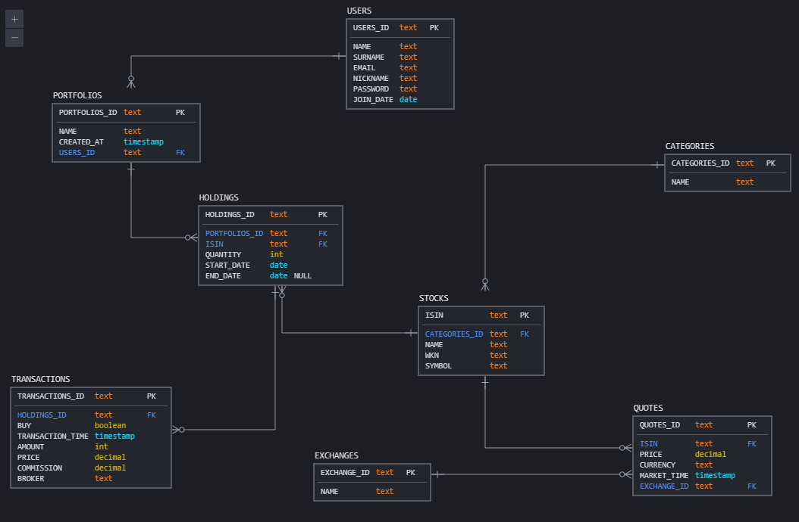

# Stock Portfolio Application - Database Layer Design

## Introduction

This document details the design of the database layer for the Stock Portfolio Application. It incorporates the recommendations from the initial design proposal and addresses the additional considerations raised during the design review. The design prioritizes a clean architecture, testability, extensibility, and performance.  It leverages the Repository Pattern with Strategy/Adapter and the Plugin Pattern to achieve these goals.  The design also incorporates a robust error handling strategy, transaction management, data validation, and security measures to ensure data integrity and application reliability.  Finally, a comprehensive testing strategy is implemented to ensure the quality and reliability of the database layer.

## Overall Architecture

The database layer will utilize the **Repository Pattern with Strategy/Adapter** as its primary architectural pattern. This pattern cleanly separates data access logic from the application's core business logic. The **Plugin Pattern** will be used to support multiple database providers (PostgreSQL and SQLite initially) and allow for easy addition of new providers in the future.  This approach ensures a clean separation of concerns, making the code more maintainable, testable, and extensible.

## Technology Stack

* **Language:** TypeScript
* **ORM:** Prisma
* **Database Providers:** PostgreSQL (primary), SQLite (secondary)
* **Testing Framework:** Mocha

## Data Model

The application's data model consists of the following entities, based on the schema in `db/all.sql`:

* **User:** `USERS_ID` (TEXT, PK), `NAME` (TEXT), `SURNAME` (TEXT), `EMAIL` (TEXT), `NICKNAME` (TEXT), `PASSWORD` (TEXT), `JOIN_DATE` (DATE)
* **Category:** `CATEGORIES_ID` (TEXT, PK), `NAME` (TEXT)
* **Stock:** `ISIN` (TEXT, PK), `CATEGORIES_ID` (TEXT, FK referencing Category), `NAME` (TEXT), `WKN` (TEXT), `SYMBOL` (TEXT)
* **Quote:** `QUOTES_ID` (TEXT, PK), `ISIN` (TEXT, FK referencing Stock), `PRICE` (DECIMAL), `CURRENCY` (TEXT), `MARKET_TIME` (TIMESTAMP), `EXCHANGE` (TEXT)
* **Portfolio:** `PORTFOLIOS_ID` (TEXT, PK), `NAME` (TEXT), `CREATED_AT` (TIMESTAMP), `USERS_ID` (TEXT, FK referencing User)
* **Holding:** `HOLDINGS_ID` (TEXT, PK), `PORTFOLIOS_ID` (TEXT, FK referencing Portfolio), `ISIN` (TEXT, FK referencing Stock), `QUANTITY` (INT), `START_DATE` (DATE), `END_DATE` (DATE)
* **Transaction:** `TRANSACTIONS_ID` (TEXT, PK), `HOLDINGS_ID` (TEXT, FK referencing Holding), `BUY` (BOOLEAN), `TRANSACTION_TIME` (TIMESTAMP), `AMOUNT` (INT), `PRICE` (DECIMAL), `COMMISSION` (DECIMAL), `BROKER` (TEXT)

For a visual representation of the relationships between these entities, see the ER diagram:
  



**Example Data Representation (PostgreSQL):**

```sql
-- Users table
CREATE TABLE users (
    USERS_ID TEXT PRIMARY KEY,
    name TEXT NOT NULL,
    surname TEXT NOT NULL,
    email TEXT NOT NULL,
    nickname TEXT NOT NULL,
    password TEXT NOT NULL,
    join_date DATE NOT NULL
);

-- Categories table
CREATE TABLE categories (
    CATEGORIES_ID TEXT PRIMARY KEY,
    name TEXT NOT NULL
);

-- Stocks table
CREATE TABLE stocks (
    isin TEXT PRIMARY KEY,
    categories_id TEXT REFERENCES categories(categories_id),
    name TEXT NOT NULL,
    wkn TEXT NOT NULL,
    symbol TEXT NOT NULL
);
```

## Repository Implementation

The Repository Pattern is a design pattern that decouples data access logic from the business logic of an application.  It introduces an abstraction layer, the `Repository`, which acts as an intermediary between the application and the data source (database).  This separation improves code organization, testability, and maintainability.  The repository provides a consistent interface for accessing data, regardless of the underlying data source.  This allows for easy switching between different data sources (e.g., different databases or even in-memory data stores) without modifying the business logic.

The Repository Pattern is implemented here using interfaces and concrete implementations for each database provider.  The interface defines the methods for accessing data, while the concrete implementations provide the specific database interactions.

**Example (TypeScript):**

```typescript
// db/interfaces/PortfolioRepository.ts
interface PortfolioRepository {
  create(portfolio: Portfolio): Promise<Portfolio>;
  findById(id: string): Promise<Portfolio | null>;
  findByUserId(userId: string): Promise<Portfolio[]>;
  // ... other methods
}

// db/providers/postgresql/PortfolioRepository.ts
import { PrismaClient } from '@prisma/client';
import { PortfolioRepository } from '../interfaces/PortfolioRepository';

class PostgresqlPortfolioRepository implements PortfolioRepository {
  private prisma: PrismaClient;

  constructor() {
    this.prisma = new PrismaClient();
  }

  async create(portfolio: Portfolio): Promise<Portfolio> {
    return this.prisma.portfolio.create({ data: portfolio });
  }

  // ... other methods
}
```

## Plugin Architecture

The Plugin Pattern is a design pattern that allows for extending the functionality of an application at runtime without modifying its core code.  This is achieved by defining a plugin interface that specifies the methods that plugins must implement.  Plugins are then loaded dynamically, allowing for flexible and extensible application behavior.  This pattern is particularly useful for supporting multiple database providers, as it allows for adding new providers without recompiling or modifying the core application code.

In this design, the Plugin Pattern will be used to manage different database providers. Each provider will be implemented as a plugin that conforms to a defined plugin interface.  This allows for easy addition and removal of database providers without affecting the core application logic.

**Example (Conceptual):**

```typescript
// db/plugin-interface/DatabasePlugin.ts
interface DatabasePlugin {
  init(): Promise<void>;
  getRepository<T extends Repository<any>>(repositoryType: { new (...args: any[]): T }): T;
  // ... other methods
}

// db/plugins/postgresql/PostgresqlPlugin.ts
import { DatabasePlugin } from '../plugin-interface/DatabasePlugin';
import { PostgresqlPortfolioRepository } from './PortfolioRepository';

class PostgresqlPlugin implements DatabasePlugin {
  // ... implementation
}
```

## Error Handling

A robust error handling strategy is crucial for a reliable database layer. This strategy will encompass several key aspects:

**1. Centralized Error Handling:** A dedicated error handling module will be created to manage all database-related exceptions. This module will provide consistent error reporting and logging, regardless of the specific database provider or the type of error encountered.  This promotes maintainability and simplifies debugging.

**2. Custom Error Types:**  Specific error types will be defined to represent different types of database errors (e.g., `ConnectionError`, `QueryError`, `DataValidationError`). This improves error clarity and allows for more precise error handling in the application logic.

**3. Exception Handling in Repositories:** Each repository method will be wrapped in a `try...catch` block to handle potential exceptions during database operations.  Caught exceptions will be passed to the centralized error handling module for logging and processing.

**4. Error Logging:** Detailed error logs will be generated, including timestamps, error messages, stack traces, and relevant context information (e.g., query parameters, affected data).  This information will be crucial for debugging and identifying the root cause of errors.  The logging mechanism should be configurable to allow for different logging levels (e.g., DEBUG, INFO, WARN, ERROR) and output destinations (e.g., console, file, centralized logging system).

**5. Consistent Error Responses:**  The centralized error handling module will ensure that consistent error responses are returned to the application.  These responses will provide informative error messages to the client without exposing sensitive internal details.  Error responses should follow a consistent format (e.g., JSON) and include appropriate HTTP status codes.

**6. Retries and Fallbacks:** For transient errors (e.g., network issues, temporary database unavailability), the system will implement retry mechanisms with exponential backoff.  For persistent errors, appropriate fallback mechanisms will be implemented to gracefully handle failures and prevent application crashes.

**Example (TypeScript):**

```typescript
// db/error-handling/ErrorHandler.ts
class ErrorHandler {
  handleError(error: Error, context: any): void {
    // Log the error with context
    console.error(`Error occurred: ${error.message}`, context);
    // ... other error handling logic (e.g., send error notification)
  }
}

// db/providers/postgresql/PortfolioRepository.ts
import { PrismaClient } from '@prisma/client';
import { PortfolioRepository } from '../interfaces/PortfolioRepository';
import { ErrorHandler } from '../error-handling/ErrorHandler';

class PostgresqlPortfolioRepository implements PortfolioRepository {
  private prisma: PrismaClient;
  private errorHandler: ErrorHandler;

  constructor() {
    this.prisma = new PrismaClient();
    this.errorHandler = new ErrorHandler();
  }

  async create(portfolio: Portfolio): Promise<Portfolio> {
    try {
      return this.prisma.portfolio.create({ data: portfolio });
    } catch (error) {
      this.errorHandler.handleError(error, { operation: 'createPortfolio', portfolio });
      throw error; // Re-throw the error to be handled by the calling function
    }
  }

  // ... other methods
}
```

**Impact on Project Structure:**

The addition of a centralized error handling module will require creating a new directory (`db/error-handling`) within the `db` folder.  This module will contain classes and functions for managing errors, logging, and generating consistent error responses.  The error handling logic will be integrated into the repository implementations and other database-related components.


## Transaction Management

Transaction management is critical for maintaining data integrity and consistency within the database.  The strategy will ensure that database operations are executed atomically, consistently, and reliably.  This section details the design for transaction management in the Stock Portfolio Application's database layer.

**1. Transaction Boundaries:**  Transactions will be defined at the service layer, encompassing all database operations required for a single business operation (e.g., creating a new portfolio, executing a trade).  This ensures that all related operations succeed or fail together, maintaining data consistency.

**2. Transaction Isolation Levels:**  Appropriate transaction isolation levels (e.g., `SERIALIZABLE`, `READ COMMITTED`) will be chosen to prevent concurrency issues and ensure data integrity.  The choice of isolation level will depend on the specific requirements of each transaction and the potential for concurrent access.

**3. Transaction Management in Repositories:**  Repository methods will not directly manage transactions.  Instead, the service layer will initiate and manage transactions, calling repository methods within the transaction scope.  This keeps transaction management logic separate from data access logic, improving code organization and testability.

**4. Error Handling within Transactions:**  Error handling within transactions is crucial.  If an error occurs during a transaction, the transaction will be rolled back to maintain data consistency.  Appropriate error messages will be logged and returned to the application.

**5. Transaction Timeouts:**  Transaction timeouts will be implemented to prevent transactions from running indefinitely and blocking resources.  The timeout value will be configurable and will depend on the expected duration of the transaction.

**6. Distributed Transactions (Future Consideration):**  For future scalability, the design should consider the possibility of distributed transactions if the application needs to interact with multiple databases.  This will require a more sophisticated transaction management strategy, potentially using two-phase commit or other distributed transaction protocols.

**Example (TypeScript - Conceptual):**

```typescript
// db/services/portfolioService.ts
import { PortfolioRepository } from '../repositories/PortfolioRepository';
import { TransactionManager } from '../transaction-management/TransactionManager';

class PortfolioService {
  private portfolioRepository: PortfolioRepository;
  private transactionManager: TransactionManager;

  constructor(portfolioRepository: PortfolioRepository, transactionManager: TransactionManager) {
    this.portfolioRepository = portfolioRepository;
    this.transactionManager = transactionManager;
  }

  async createPortfolio(portfolio: Portfolio): Promise<Portfolio> {
    return this.transactionManager.runTransaction(async (transaction) => {
      // Access the database using the transaction object
      return this.portfolioRepository.create(portfolio, transaction);
    });
  }
}
```

**Impact on Project Structure:**

A new `transaction-management` directory will be added to the `db` folder. This directory will contain classes and functions for managing transactions, including initiating, committing, rolling back, and handling errors within transactions.  The transaction management logic will be integrated into the service layer.


## Data Validation

Data validation is crucial for maintaining data integrity and preventing errors.  A multi-layered approach will be implemented, combining validation at the application layer, service layer, and database layer.

**1. Application Layer Validation:**  Input validation will be performed at the application layer before data is passed to the service layer.  This initial validation will check for basic data types, required fields, and format constraints.  Libraries like Joi or Zod can be used for this purpose.

**2. Service Layer Validation:**  The service layer will perform additional validation to ensure data consistency and business rules are met.  This might include checking for data conflicts, verifying relationships between entities, and performing more complex validation logic.

**3. Database Layer Validation:**  Database constraints (e.g., `NOT NULL`, `UNIQUE`, `CHECK`, `FOREIGN KEY`) and triggers will be used to enforce data integrity at the database level.  This ensures that invalid data cannot be inserted or updated into the database.

**Example (TypeScript - Application Layer with Joi):**

```typescript
// Assuming you are using Joi for validation
import * as Joi from 'joi';

const portfolioSchema = Joi.object({
  name: Joi.string().required(),
  userId: Joi.string().required(),
  // ... other fields
});

// Validate portfolio data
const { error, value } = portfolioSchema.validate(portfolioData);
if (error) {
  // Handle validation error
  throw new Error(`Invalid portfolio data: ${error.message}`);
}

// Use the validated data
const validatedPortfolio = value;
```

**Example (TypeScript - Service Layer Validation):**

```typescript
// ... in your service layer ...

async createPortfolio(portfolio: Portfolio): Promise<Portfolio> {
  // Check for existing portfolio with the same name and user ID
  const existingPortfolio = await this.portfolioRepository.findByNameAndUserId(portfolio.name, portfolio.userId);
  if (existingPortfolio) {
    throw new Error('Portfolio with this name already exists for this user.');
  }
  // ... other validation and database operations ...
}
```

**Impact on Project Structure:**

The data validation logic will be distributed across the application, service, and database layers.  The application layer will use validation libraries, while the service layer will contain custom validation functions.  Database constraints and triggers will be defined in the database schema.  This approach ensures that validation is performed at multiple levels, providing a robust and comprehensive validation strategy.


## Performance Considerations

Database performance is critical for a responsive and scalable application.  The following strategies will be implemented to ensure optimal performance:

**1. Connection Pooling:** A connection pool will be used to manage database connections efficiently.  This avoids the overhead of establishing new connections for each database operation, significantly improving performance, especially under high load.  The pool size will be configured based on the expected load and available resources.

**2. Query Optimization:**  Database queries will be optimized to minimize resource consumption.  This includes using appropriate indexes, avoiding unnecessary joins, and using efficient query patterns.  Query execution plans will be analyzed using database tools to identify and address performance bottlenecks.  The ORM (Prisma) will be leveraged for its built-in query optimization capabilities.

**3. Indexing:**  Appropriate indexes will be created on frequently queried columns to speed up data retrieval.  The choice of indexes will depend on the application's query patterns and data access needs.  Index usage will be monitored to ensure that indexes are effective and not causing performance degradation in other areas.

**4. Caching:**  Caching frequently accessed data (e.g., stock quotes) will reduce the load on the database.  A caching mechanism (e.g., Redis) will be implemented to store frequently accessed data in memory, reducing the number of database queries.  The cache invalidation strategy will be carefully designed to ensure data consistency.

**5. Database Tuning:**  The database server will be tuned to optimize performance.  This includes configuring parameters such as buffer pool size, connection limits, and other performance-related settings.  Database monitoring tools will be used to track performance metrics and identify areas for improvement.

**6. Read Replicas (Future Consideration):**  For high-read-load scenarios, read replicas can be implemented to distribute the read load across multiple database servers.  This will improve the responsiveness of read-heavy operations.

**7. Database Sharding (Future Consideration):**  For very large datasets, database sharding can be implemented to distribute data across multiple database servers.  This will improve scalability and performance for very large datasets.


**Impact on Project Structure:**

Implementing these performance optimizations will not significantly alter the project's overall structure.  However, it will require careful configuration of the database server, the ORM (Prisma), and the caching mechanism.  Monitoring tools will need to be integrated to track performance metrics and identify areas for improvement.


## Security

Security is paramount for any application handling sensitive financial data.  The following security measures will be implemented:

**1. Secure Connection Management:** All database connections will be established using SSL/TLS encryption to protect data in transit.  This prevents eavesdropping and ensures that sensitive data is not intercepted by unauthorized parties.  The use of strong encryption ciphers will be enforced.

**2. Input Sanitization and Parameterized Queries:**  All user inputs will be carefully sanitized to prevent SQL injection vulnerabilities.  Parameterized queries will be used consistently to prevent malicious code from being injected into database queries.  This is a fundamental security measure to protect against SQL injection attacks.

**3. Access Control:**  A robust access control mechanism will be implemented to restrict access to sensitive data.  This will involve defining roles and permissions, ensuring that only authorized users can access specific data and perform certain operations.  The principle of least privilege will be strictly adhered to, granting users only the necessary permissions to perform their tasks.

**4. Data Encryption:**  Sensitive data (e.g., passwords, financial information) will be encrypted at rest and in transit using strong encryption algorithms.  This protects data even if the database server is compromised.  Key management will be implemented securely, using appropriate key rotation and protection mechanisms.

**5. Regular Security Audits:**  Regular security audits and penetration testing will be conducted to identify and address potential vulnerabilities.  These audits will help ensure that the database remains secure and protected against evolving threats.

**6. Secure Password Handling:**  Passwords will be stored using strong hashing algorithms (e.g., bcrypt, Argon2) with appropriate salting and peppering techniques.  This prevents passwords from being easily cracked even if the database is compromised.

**7. Regular Software Updates:**  The database software and related libraries will be kept up-to-date with the latest security patches to address known vulnerabilities.

**8. Principle of Least Privilege:**  Database users will be granted only the minimum necessary privileges to perform their tasks.  This limits the potential damage caused by a compromised account.

**Impact on Project Structure:**

Implementing these security measures will not significantly change the overall project structure.  However, it will require careful configuration of the database server, the use of secure coding practices, and the integration of security tools and libraries.  Regular security audits and penetration testing will be incorporated into the development lifecycle.


## Migration Strategy

Managing database schema changes effectively is crucial for maintaining a robust and reliable database.  This section details the migration strategy for the Stock Portfolio Application.

**1. Version Control:** All database migrations will be version-controlled using a dedicated system (e.g., Git).  This allows for tracking changes, reverting to previous versions if necessary, and ensuring that migrations are applied consistently across different environments.

**2. Migration Files:**  Each migration will be represented by a separate file containing the SQL statements required to update the database schema.  These files will be named according to a consistent convention (e.g., `YYYYMMDDHHMMSS_description.sql`).  This approach ensures that migrations are easily identifiable and manageable.

**3. Atomic Migrations:**  Each migration file will contain a single, atomic migration.  This ensures that if a migration fails, the database remains in a consistent state.  Partial migrations are avoided.

**4. Up and Down Migrations:**  Each migration will include both "up" and "down" migration scripts.  The "up" script applies the changes, while the "down" script reverts them.  This allows for easy rollback of migrations if necessary.

**5. Migration Tooling:**  Prisma's migration system will be used to manage the migration process.  This provides a convenient and reliable way to apply and rollback migrations.  The Prisma CLI will be used to generate, apply, and manage migration files.

**6. Testing Migrations:**  Migrations will be thoroughly tested before deployment to prevent unexpected issues.  This might involve running the migrations against a test database and verifying that the schema changes are applied correctly.

**7. Deployment Process:**  The migration process will be integrated into the application's deployment pipeline.  This ensures that migrations are applied automatically during deployment, minimizing downtime and ensuring consistency across environments.

**Impact on Project Structure:**

A dedicated directory (e.g., `db/migrations`) will be created to store the migration files.  The migration process will be integrated into the deployment pipeline.  This structured approach ensures that database schema changes are managed effectively and reliably.


## Testing Strategy

A comprehensive testing strategy is crucial for ensuring the quality, reliability, and security of the database layer. This strategy will encompass several key aspects:

**1. Unit Testing:** Unit tests will be written to test individual components and functions within the database layer.  This includes testing repository methods, error handling logic, and transaction management functions.  Mocking will be used to isolate the units under test from external dependencies (e.g., the database).  Unit tests should focus on verifying the correctness of individual units in isolation.

**2. Integration Testing:** Integration tests will be written to test the interaction between different components within the database layer and with other parts of the application.  This includes testing the interaction between repositories and the database, the plugin loading mechanism, and the transaction management system.  Integration tests should verify that different components work together correctly.

**3. End-to-End Testing:** End-to-end tests will be written to test the entire database layer from start to finish, simulating real-world scenarios.  This includes testing the complete workflow of database operations, including data validation, error handling, and transaction management.  End-to-end tests should verify that the entire system functions as expected.

**4. Test Data Management:**  A robust test data management strategy will be implemented to ensure that tests are run against consistent and reliable data.  This might involve using test databases, seeding data, and generating test data.

**5. Test Coverage:**  Test coverage will be monitored to ensure that a sufficient portion of the codebase is covered by tests.  High test coverage is essential for ensuring the quality and reliability of the database layer.

**6. Continuous Integration:**  The testing process will be integrated into a continuous integration (CI) pipeline.  This ensures that tests are run automatically whenever code changes are made, providing early detection of potential issues.

**Impact on Project Structure:**

A dedicated directory (e.g., `db/tests`) will be created to store the test files.  The testing process will be integrated into the CI/CD pipeline.  This structured approach ensures that the database layer is thoroughly tested and that potential issues are identified early in the development process.

## Recommended Utility Scripts

### 1. Migration Scripts
- Schema version control
- Up/down migrations
- Seed data management
- Migration history tracking

### 2. Testing Utilities
- Database mocking utilities
- Test data generators
- Integration test helpers
- Performance testing tools

### 3. Administration Scripts
- Database initialization
- Backup/restore utilities
- Health check scripts
- Data validation tools

### 4. Development Tools
- Schema visualization
- Query logging/debugging
- Performance monitoring
- Database connection management

## File Structure Impact

The `db` folder will be restructured to accommodate the chosen architecture. The new structure will include subfolders for interfaces, providers, repositories, and plugins.  A new `transaction-management` subfolder will be added.

```
db/
├── interfaces/
├── providers/
│   ├── postgresql/
│   └── sqlite/
├── repositories/
├── plugins/
│   ├── postgresql/
│   └── sqlite/
├── error-handling/
├── transaction-management/
└── ...
```

## Next Steps

1. Implement the repository interfaces.
2. Implement the PostgreSQL and SQLite providers.
3. Implement the plugin architecture.
4. Implement the data model and migrations.
5. Write unit and integration tests.
6. Implement error handling, transaction management, and data validation.
7. Optimize for performance and security.
