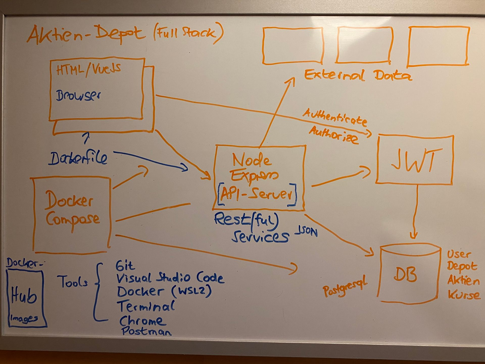

# Overview

“Stock Portfolio” is a study project aimed at developing the skills required by a modern “full-stack developer” to create enterprise applications as a member of an agile Scrum team. The project will develop a web and mobile application for managing stock portfolios, using a multi-layer architecture with frontend, middleware (backend-for-frontend), and database backend.

These are the main features of the application:

* The application will allow users to create, view, and manage their portfolios, including stock holdings and transactions.
* The application will provide a user-friendly interface for viewing and managing portfolios, as well as stock holdings and transactions.
* The application will allow users to view stock quotes and historical data.

These are the main technologies and tools that will be used in the development of the application:

* JavaScript, primarily in combination with NodeJS, will be used as the programming language. JavaScript frameworks include VueJS for the frontend and ExpressJS for the middleware. The middleware mainly provides a REST API for service requests from the frontend, through which all database access is managed. External REST APIs, such as Yahoo Finance, will be used to obtain stock data. The database backend will be implemented with PostgreSQL. A JWT server (Keycloak) will be used for user authentication and authorization. We have chosen Mocha as the testing framework.
* The tool stack includes the following programs: Visual Studio Code, Git (GitLab Community Edition), cURL, Postman, Google Chrome, Windows Terminal, and HeidiSQL.
* The entire application is intended to run in multiple containers from the start, using Docker Compose, with Visual Studio Devcontainer utilized from the development phase.
* The following tools will be used for project documentation: Jira for issue tracking, Confluence for comprehensive documentation, Miro for brainstorming, Visual Paradigm Community Edition as a UML tool, and SqlDBM for database modeling. Microsoft PowerPoint will be used for presentations.
* Finally, as an add-on, deployment of the completed software to a Kubernetes cluster is planned. As part of a local Kubernetes installation using Minikube or k3s, a small DevOps pipeline in GitLab will also be implemented.

The following image illustrates the basic architecture of the study project:
  
