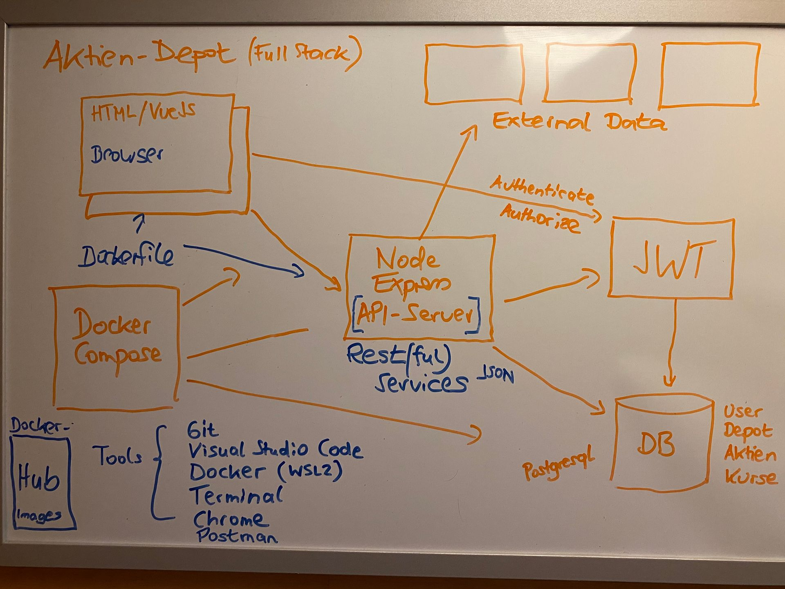
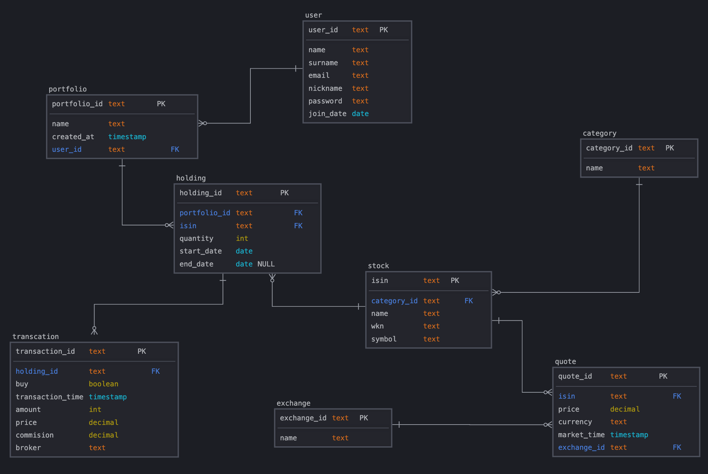

# Stock Portfolio

> This project serves as a comprehensive example of how a complete full-stack application can be developed using AI tools, specifically "Cline". While the development followed an iterative approach, each architectural layer (database, BFF, etc.) was generated as a complete unit through AI assistance. The entire development process, including AI interactions and decision-making, is documented in the task logs located in the `cline` folder. These logs are organized into logical subfolders corresponding to different layers of the application (db-design, db-implementation, bff-design, bff-implementation, etc.), providing valuable insights into AI-assisted software development practices.
>
> Initial information provided to the AI:
>
> - Overview Diagram (docs/overview.jpeg)
> - Project information (docs/overview.md)
> - The db model as seen in the DB section (db/model.png)
> - SQL Code for db creation (db/sql/all.sql)


## General Information

Initial purpose of the "Stock Portfolio" was a study project aimed at developing the skills required by a modern "full-stack developer" to create enterprise applications as a member of an agile Scrum team. The project develops a web and mobile application for managing stock portfolios, using a multi-layer architecture with frontend, middleware (backend-for-frontend), and database backend.



### Main Features
- Create, view, and manage stock portfolios
- Track stock holdings and transactions
- View stock quotes and historical data
- User-friendly interface for portfolio management
- Real-time market data integration
- Secure authentication and authorization

### Technology Stack
- **Frontend**: JavaScript with VueJS
- **Middleware**: NodeJS with ExpressJS, providing REST API
- **Database**: PostgreSQL
- **Authentication**: JWT (Keycloak)
- **External APIs**: Yahoo Finance integration
- **Testing**: Mocha framework

### Development Tools
- Visual Studio Code
- Git (GitLab Community Edition)
- cURL
- Postman
- Google Chrome
- Windows Terminal
- HeidiSQL

### Project Documentation Tools
- Jira (Issue tracking)
- Confluence (Comprehensive documentation)
- Miro (Brainstorming)
- Visual Paradigm Community Edition (UML)
- SqlDBM (Database modeling)
- Microsoft PowerPoint (Presentations)

## Project Structure

The application follows a modern, layered architecture consisting of three main components:

### 1. Database Layer
Located in `/db`, handles data persistence and management:
```
db/
├── interfaces/          # Repository interfaces
├── providers/          # Database provider implementations
├── repositories/       # Data access layer
├── plugins/           # Database plugins (PostgreSQL, SQLite)
├── error-handling/    # Error management
├── transaction-management/
├── migrations/        # Database migrations
└── tests/            # Database tests
```

### 2. BFF (Backend-For-Frontend) Layer
Located in `/bff`, serves as the API middleware:
```
bff/
├── src/
│   ├── config/        # Configuration files
│   ├── controllers/   # Request handlers
│   ├── models/        # Data models/interfaces
│   ├── services/      # Business logic
│   ├── middleware/    # Custom middleware
│   ├── routes/        # API route definitions
│   └── utils/         # Utility functions
└── tests/            # BFF tests
```

### 3. UI Layer (Planned)
Will be implemented as part of the roadmap, focusing on a modern, responsive user interface.

## Technical Insights

### Database Layer

#### Model Overview

The database model represents a comprehensive stock portfolio management system with interconnected entities. At its core, Users can manage multiple Portfolios, each containing various Holdings of Stocks. Each Holding tracks a specific Stock position and its associated Transactions (buys/sells). Stocks are organized into Categories for better classification, and the system maintains historical Quote data for each Stock. This relational model ensures data integrity while providing flexibility for portfolio management and performance tracking.



#### Architecture
- Implements Repository Pattern with Strategy/Adapter
- Uses Plugin Pattern for multiple database providers
- Supports PostgreSQL (primary) and SQLite (secondary)
- Implements comprehensive error handling and transaction management

#### Key Features
- Connection pooling for optimal performance
- Robust data validation at multiple levels
- Secure data handling with encryption
- Migration management system
- Comprehensive testing strategy

### BFF Layer

#### Architecture
- Built with Express.js and TypeScript
- Implements REST API principles
- Uses JWT authentication with Keycloak integration
- Includes comprehensive middleware stack

#### Key Components
- Controllers for handling HTTP requests
- Services for business logic
- Models for type-safe data handling
- Middleware for auth, validation, and error handling
- Integration with Yahoo Finance API

### Security Features
- JWT-based authentication
- Role-based access control
- Input validation and sanitization
- SQL injection prevention
- XSS protection
- Secure headers
- Rate limiting

## Layer Details

### 1. Database Layer
- **Data Model**: Includes entities for Users, Portfolios, Stocks, Holdings, Transactions, and Quotes
- **Transaction Management**: Ensures data consistency across operations
- **Migration System**: Manages schema changes and versioning
- **Plugin Architecture**: Allows easy addition of new database providers
- **Performance Optimization**: Implements connection pooling and query optimization

### 2. BFF Layer
- **API Endpoints**: RESTful endpoints for all major operations
- **Authentication**: Keycloak integration for secure access
- **Data Validation**: Multiple layers of validation
- **Error Handling**: Centralized error management
- **External Integration**: Yahoo Finance API integration
- **Monitoring**: Comprehensive logging and metrics

### 3. UI Layer (Planned)
Will focus on:
- Modern, responsive design
- Real-time data updates
- Interactive charts and visualizations
- Intuitive portfolio management
- Mobile-first approach

## Roadmap

### 1. UI Layer Implementation
- Design system development
- Component library creation
- State management implementation
- Real-time updates integration
- Responsive layout development
- Accessibility compliance
- Performance optimization

### 2. Containerization via Docker Compose
- Container definitions for all services
- Development environment setup
- Production environment configuration
- Volume management
- Network configuration
- Health check implementation
- Logging configuration

### 3. DevContainer Configuration
- VS Code development container setup
- Development tools integration
- Extension configuration
- Environment standardization
- Debug configuration
- Source control integration
- Task automation

### 4. Renovate Integration
- Dependency update automation
- Update schedule configuration
- Version pinning strategy
- Monorepo support
- Auto-merge configuration
- Security update prioritization
- Change log generation

### 5. DevOps Pipeline
- Kubernetes deployment (using Minikube or k3s)
- GitLab CI/CD pipeline implementation
- Local Kubernetes cluster setup
- Automated deployment workflow

## Development Practices

### Code Quality
- TypeScript for type safety
- ESLint for code quality
- Prettier for code formatting
- Git hooks for pre-commit checks
- Comprehensive testing strategy
- Code review process

### Testing Strategy
- Unit tests for all layers
- Integration tests for APIs
- End-to-end testing
- Performance testing
- Security testing
- Automated CI/CD pipeline

### Documentation
- API documentation (OpenAPI/Swagger)
- Code documentation
- Architecture documentation
- Development guides
- Deployment guides

## Performance Considerations

### Database Optimization
- Connection pooling
- Query optimization
- Indexing strategy
- Caching implementation
- Read replica support (future)
- Database sharding (future)

### API Optimization
- Response caching
- Rate limiting
- Pagination
- Data compression
- Request batching
- Resource cleanup

### Security Measures
- Data encryption
- Access control
- Input sanitization
- Regular security audits
- Secure password handling
- Regular updates and patches
