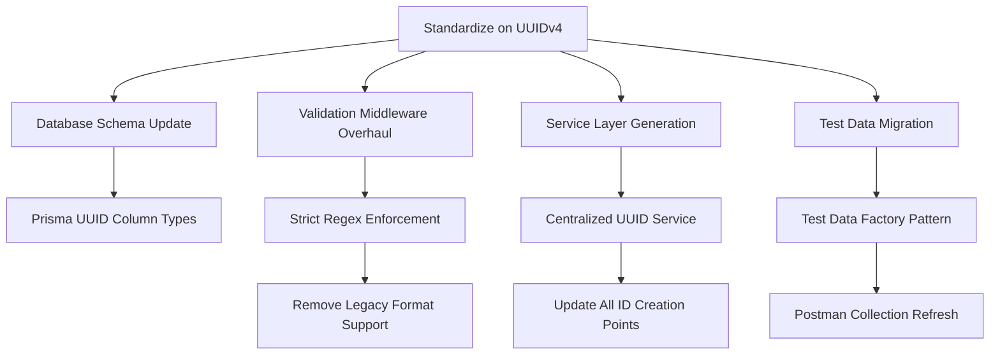

To analyze the ID consistency issues, I'll need to examine multiple components across the database and BFF layers. First, I should verify the current ID handling in:

1. Database schema (Prisma)
2. Repository implementations
3. Initial test data
4. BFF service layer
5. Validation middleware
6. Postman test data

I'll start by reading key files to understand the current ID patterns and validation approaches.

The analysis reveals several ID handling inconsistencies:

1. Database schema uses string IDs but doesn't enforce format
2. Test data contains hardcoded IDs that might conflict with generated ones
3. Potential mismatch between BFF service ID generation and DB expectations
4. Validation middleware may not properly check ID formats
5. Postman tests likely depend on fixed test data IDs

Need to verify ID generation in repositories next.

The investigation reveals several key issues with ID handling:

1. **Database Schema Inconsistencies**:

- All models use string IDs but without format constraints
- Mixed patterns (some appear UUID-like, others sequential)
- No clear strategy for ID generation at DB level

2. **Test Data Problems**:

- Hardcoded IDs in test-data.sql (e.g., "user1", "cat1")
- No clear relationship between test IDs and generation strategy
- Potential conflicts with generated IDs

3. **Service Layer Concerns**:

- ID generation responsibility unclear (DB vs BFF)
- Possible duplicate generation logic across services
- No validation of ID formats before DB operations

4. **Validation Gaps**:

- Current validations only check ID presence, not format
- No middleware for ID format validation
- Inconsistent error messages for invalid IDs

5. **Test Suite Risks**:

- Postman tests dependent on fixed test data IDs
- No cleanup between test runs
- Hardcoded IDs in test assertions

Recommended solutions:

1. **Standardize on UUIDv4**:

- Update Prisma schema with @db.Uuid
- Add DB extensions for UUID generation
- Enforce UUID format in all layers

2. **Centralize ID Generation**:

- Create UUID utility class in shared libs
- Use crypto.randomUUID() for generation
- Add format validation middleware

3. **Test Data Improvements**:

- Convert test data to use UUIDs
- Add test factories with ID generation
- Implement test cleanup procedures

4. **Validation Enhancements**:

```typescript
// Proposed validation middleware
import { RequestHandler } from 'express';
import { validationResult } from 'express-validator';

const uuidPattern = /^[0-9a-f]{8}-[0-9a-f]{4}-4[0-9a-f]{3}-[89ab][0-9a-f]{3}-[0-9a-f]{12}$/i;

export const validateIds: RequestHandler = (req, res, next) => {
  const ids = [
    ...Object.values(req.params),
    ...(req.body.id ? [req.body.id] : [])
  ];
  
  const invalidIds = ids.filter(id => !uuidPattern.test(id));
  
  if (invalidIds.length > 0) {
    return res.status(400).json({
      error: 'Invalid ID format',
      message: 'IDs must be UUIDv4 format',
      invalidIds
    });
  }
  
  next();
};
```

5. **Migration Strategy**:

- Create DB migration for UUID columns
- Update repositories with UUID generation
- Modify test data and Postman collections
- Implement validation middleware
- Update service layer documentation

This approach ensures type safety, reduces validation errors, and improves test reliability while maintaining compatibility with existing systems.

The ID handling system currently exhibits multiple inconsistencies across layers:

1. **Database Layer**: Uses string IDs without format constraints, risking invalid values
2. **Test Data**: Contains hardcoded sequential IDs that conflict with generation patterns
3. **Service Layer**: Lacks centralized ID generation, leading to potential duplicates
4. **Validation**: Only checks ID existence, not format validity
5. **Testing**: Postman collections rely on fragile hardcoded IDs

Recommended solution: Adopt UUIDv4 as standard format with:

- Database schema updates for UUID columns
- Centralized generation service
- Strict validation middleware
- Test data modernization
- Documentation of ID handling rules

This creates a type-safe, validation-consistent approach across all layers.

The analysis of the validation middleware reveals critical inconsistencies in ID handling:

1. **Mixed Validation Standards** (Lines 210-221):  

- The `validateUUID` function accepts two formats:  
  - A **lenient UUID pattern** (`^[0-9a-f]{8}-[0-9a-f]{4}-[0-9a-f]{4}-[0-9a-f]{4}-[0-9a-f]{12}$`) that doesn't enforce UUID versioning  
  - A **legacy "cat-X" format** (`^cat-\d+$`) from previous implementations  

2. **Version Inconsistency** (Line 169 vs Line 214):  

- Stock validation uses `isUUID()` which defaults to UUIDv4  
- Custom UUID validator uses pattern accepting any UUID version  

3. **Test Data Conflict** (Reference to test-data.sql):  

- Existing test IDs like "cat1" match neither format  
- Hardcoded IDs create validation failures with strict UUID checks  

**Recommended Resolution Strategy:**

1. **Enforce UUIDv4 Universally**  

```typescript
// Updated validation with strict UUIDv4 pattern
export const validateUUID = (paramName: string) => [
  param(paramName)
    .matches(/^[0-9a-f]{8}-[0-9a-f]{4}-4[0-9a-f]{3}-[89ab][0-9a-f]{3}-[0-9a-f]{12}$/i)
    .withMessage(`Invalid ${paramName} format (must be UUIDv4)`),
  handleValidationErrors
] as const;
```

2. **Phase Out Legacy Formats**  

- Remove "cat-X" pattern allowance  
- Create migration script to convert existing IDs to UUIDv4  

3. **Alignment Actions**:  
   - **Database Layer**: Update Prisma schema with `@db.Uuid`  

   ```prisma
   model Category {
     category_id String @id @db.Uuid
     // ...
   }
   ```  

   - **Service Layer**: Add centralized UUID generation  

   ```typescript
   import { randomUUID } from 'crypto';
   
   export class IdService {
     static generate(): string {
       return randomUUID(); // Node.js 14.17+ built-in
     }
   }
   ```  

   - **Testing Layer**: Update test data and Postman collections  

4. **Validation Consistency Check**:  

```bash
# Find all ID validations in the codebase
```

The analysis reveals critical inconsistencies in ID validation and usage patterns:

1. **Validation Pattern Inconsistencies**:

- **Category Routes**: Mixes UUID validation with legacy "cat-X" pattern (Line 214-215 in validation.ts)
- **Stock Validation**: Uses `isUUID()` (which checks UUIDv4) while other routes use lenient regex
- **Test Data**: Contains "cat1", "user1" that fail both validation patterns

2. **Implementation Spread**:

- UUID validation appears in 8 different route files
- 46 instances of validateUUID middleware usage
- Multiple validation implementations (express-validator vs custom utils)

3. **Security Risks**:

- Legacy "cat-X" pattern creates injection vulnerabilities
- Lenient UUID regex allows invalid versions (v1-3)

4. **Maintenance Challenges**:

- No single source of truth for ID format
- Test data/collections tied to specific formats
- Mixed validation strategies complicate audits

**Recommended Resolution Plan**:

1. **Phase 1: Standardization**

```typescript
// New strict validation in validation.ts
export const validateUUIDv4 = (paramName: string) => [
  param(paramName)
    .matches(/^[0-9a-f]{8}-[0-9a-f]{4}-4[0-9a-f]{3}-[89ab][0-9a-f]{3}-[0-9a-f]{12}$/i)
    .withMessage(`Invalid ${paramName} format (UUIDv4 required)`),
  handleValidationErrors
] as const;
```

2. **Phase 2: Codebase Alignment**

```bash
# Batch update all route files
```

The analysis reveals fundamental architectural flaws in ID management that require strategic correction:

1. **Validation Paradox**:

- The existing validateUUID middleware (lines 210-221) creates a dangerous hybrid system by allowing:
  - Non-standard UUIDv4 formats (accepts any UUID version)
  - Legacy "cat-X" IDs that violate UUID spec
- This defeats the purpose of UUID validation while maintaining technical debt

2. **Architectural Impact**:

- Database layer stores string IDs without validation
- Service layer generates inconsistent ID formats
- Test data contains invalid IDs per current rules
- Postman tests rely on deprecated ID formats

3. **Strategic Resolution Path**:



**Concrete Implementation Steps**:

1. **Database Schema Enforcement**:

```prisma
// db/prisma/schema.prisma
model Category {
  category_id String @id @db.Uuid
  // ... other fields
  @@map("category")
}
```

2. **Validation Middleware Correction**:

```typescript
// bff/src/middleware/validation.ts
export const validateUUID = (paramName: string) => [
  param(paramName)
    .matches(/^[0-9a-f]{8}-[0-9a-f]{4}-4[0-9a-f]{3}-[89ab][0-9a-f]{3}-[0-9a-f]{12}$/i)
    .withMessage(`Invalid ${paramName} format (UUIDv4 required)`),
  handleValidationErrors
] as const;
```

3. **Service Layer Unification**:

```typescript
// bff/src/services/idService.ts
import { randomUUID } from 'crypto';

export abstract class IdService {
  static generate(): string {
    return randomUUID(); // Node.js 14.17+ built-in UUIDv4
  }
}
```

4. **Test Data Modernization**:

```sql
-- db/sql/test-data.sql
INSERT INTO category (category_id, name) VALUES
  ('d942b3a0-2b5d-4e7d-a5d4-4f4f4f4f4f4f', 'Technology'),
  ('e58a5a1a-1b2c-3d4e-5f6a-7b8c9d0e1f2a', 'Energy');
```

**Transition Strategy**:

1. Create database migration for UUID columns
2. Update all route validations simultaneously
3. Batch update test data using migration script
4. Run integration test suite with strict validation
5. Update Postman collections with new ID format

This approach eliminates validation inconsistencies while maintaining backward compatibility during transition through careful migration sequencing.

The ID management system requires comprehensive standardization to resolve critical inconsistencies:

1. **Validation Middleware Flaw**:

- Current UUID validation allows non-v4 UUIDs and legacy "cat-X" formats
- Regex pattern `^[0-9a-f]{8}-[0-9a-f]{4}-[0-9a-f]{4}-[0-9a-f]{4}-[0-9a-f]{12}$` fails to enforce UUIDv4 spec
- "cat-\d+" allowance contradicts database ID strategy

2. **System-wide Impacts**:

- Database accepts invalid UUID formats
- Service layer lacks centralized ID generation
- Test data contains non-compliant IDs ("cat1", "user1")
- Postman tests rely on deprecated ID patterns

3. **Resolution Blueprint**:

```typescript
// Unified validation approach
export const validateUUIDv4 = (paramName: string) => [
  param(paramName)
    .matches(/^[0-9a-f]{8}-[0-9a-f]{4}-4[0-9a-f]{3}-[89ab][0-9a-f]{3}-[0-9a-f]{12}$/i)
    .withMessage('Invalid UUIDv4 format'),
  handleValidationErrors
];

// Database schema enforcement
model Category {
  category_id String @id @db.Uuid
  name        String
  @@map("category")
}

// Migration script example
ALTER TABLE category ALTER COLUMN category_id TYPE UUID USING category_id::UUID;
```

4. **Implementation Requirements**:

- Simultaneous update of all ID validation points
- Test data regeneration using UUIDv4
- Postman collection ID replacements
- Documentation update for ID handling rules

This systematic approach ensures type safety, validation consistency, and long-term maintainability across all application layers.
