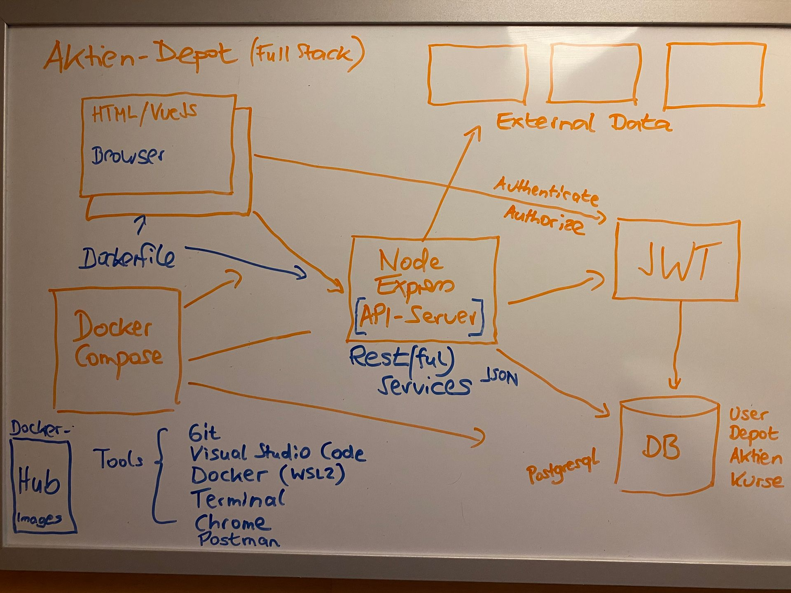

# Overview

“Stock Portfolio” is a study project aimed at developing the skills required by a modern “full-stack developer” to create enterprise applications as a member of an agile Scrum team. The project will develop a web and mobile application for managing stock portfolios, using a multi-layer architecture with frontend, middleware (backend-for-frontend), and database backend.

These are the main features of the application:

- The application will allow users to create, view, and manage their portfolios, including stock holdings and transactions.
- The application will provide a user-friendly interface for viewing and managing portfolios, as well as stock holdings and transactions.
- The application will allow users to view stock quotes and historical data.

These are the main technologies and tools that will be used in the development of the application:

- Overall TypeScript in combination with NodeJS will be used as the programming language.
- BFF: TypeScript with ExpressJS
- The BFF provides a REST API for service requests from the frontend, through which all database access is managed.
- External REST APIs, such as Yahoo Finance, will be used to obtain stock data.
- The database backend will be a Typescript db layer with a PostgreSQL database.
- A JWT server (Keycloak) will be used for user authentication and authorization.
- We have chosen Mocha as the framework for unit tests.
- The tool stack includes the following programs:
  - Visual Studio Code,
  - Github,
  - cURL for testing the REST API,
  - Postman for testing the REST API.
- The entire application is intended to run in multiple containers using Docker Compose, utilizing Devcontainers for development.
- The following tools will be used for project documentation:
  - Github for issue tracking,
  - All the documentation is kept inside the docs folder of the repo mainly as md files,
- A DevOps pipelines for Github Actions as well as for GitLab CD/CD will also be implemented.
- The project will be deployed into a Kubernetes cluster.

The following image illustrates the basic architecture of the study project:
  

